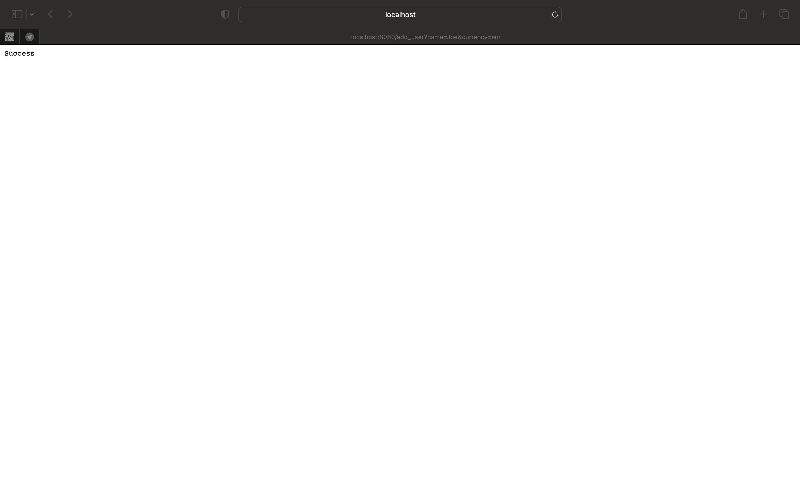

## Reactive market on C++

### Установка вспомогательнх модулей
- Установить MongoCxx driver (https://mongocxx.org/mongocxx-v3/installation/)
- Установите RxCpp через CMake (инструкция есть в соответствующем подмодуле)

### Запросы
- Добавить пользователя : localhost:8080/add_user?name=Joe&currency=eur

- Добавить продукт  : localhost:8080/add_product?name=cam&price=1000

- Посмотреть каталог в соответствии с валютой пользователя : localhost:8080/catalog?name=Joe
